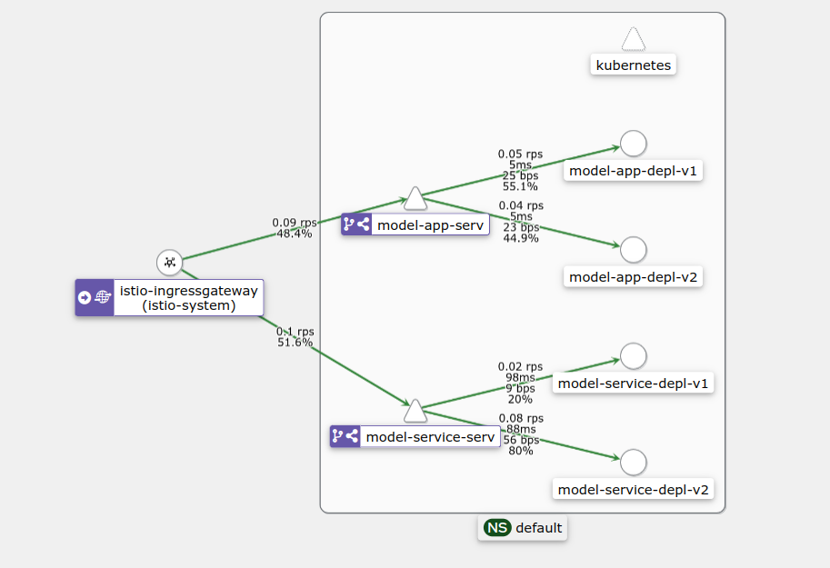
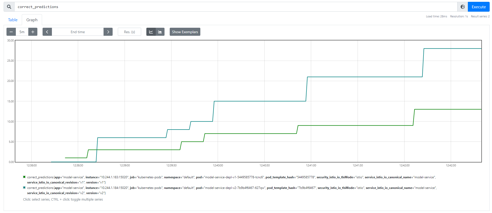
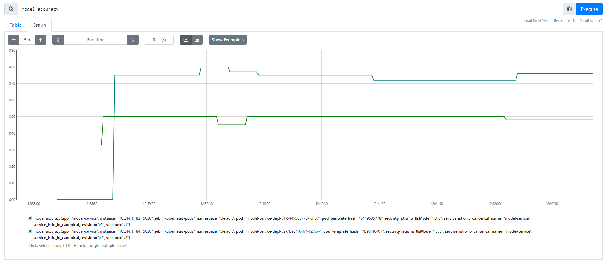
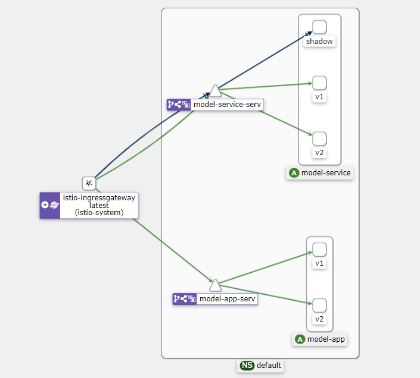
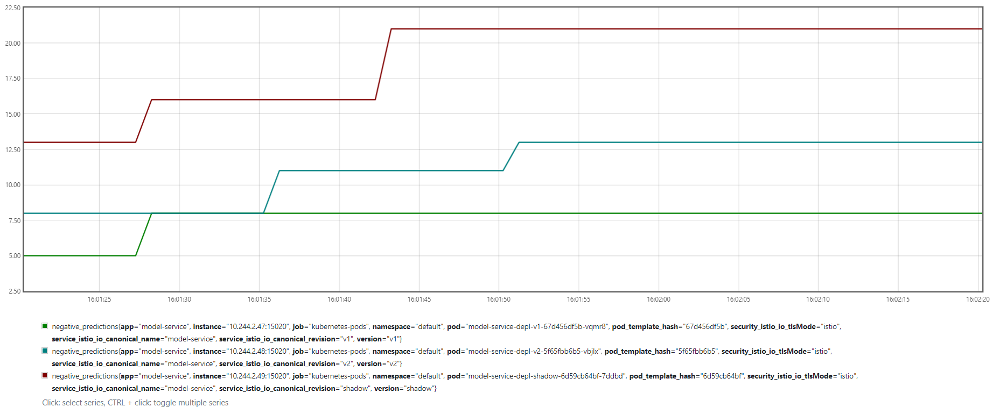

# Operation
Contains all deployment files for Docker Compose, Kubernetes &amp; Helm.

## Setup
Follow the instructions to run the application locally.

Make sure you have Docker, Docker Compose, Kubernetes ans Helm installed.

### Clone
Clone the operation repository:
```bash
$ git clone https://github.com/remla23-team15/operation.git
```

### Ways to run the application:
Move into the `operation` folder and start the services by following one of the latter set of steps:

1. [Docker Compose](#docker-compose) (assignment 1)
2. [Kubernetes](#kubernetes) (assignment 2)
3. [Helm](#helm) (assignment 2)
4. [Kubernetes + istio](#istio) (assignment 3)

## Docker-Compose
```bash
$ docker-compose up -d
```

To access the main page of the application open your browser and go to:
```bash
localhost:8081
``` 
Type in a review and request a sentiment analysis! 

Access the metrics with:
```bash
localhost:8081/metrics
```

Access the Prometheus interface with the following command:
```bash
localhost:9090
```

and the Grafana interface with the following:
```bash
localhost:3000
```

Use "admin" and "admin" as username and password to login into grafana and search for the "Restaurants Reviews Sentiment" dashboard under the Dashboards menu.

To stop the run:
```bash
$ docker-compose down
```

## Kubernetes

**Requirements:**

- Minikube must be running with Ingress enabled
- Prometheus and Grafana Helm charts must be made available using:
```bash
$ helm repo add prom-repo https://prometheus-community.github.io/helm-charts
$ helm repo update
```

To deploy the app, run:

```bash
# K8s configuration
$ helm install monitormodelapp prom-repo/kube-prometheus-stack --set prometheus.service.nodePort=30000 --set prometheus.service.type=NodePort --set grafana.service.nodePort=30001 --set grafana.service.type=NodePort

# App deployment
$ kubectl apply -f model-app.yml
```
Enable the communication (not necessary for Linux):
```bash
$ minikube tunnel
```
or 
```bash
$ minikube service model-app-serv --url
# and access the http://127.0.0.1:xxxxx from the output
```

To access the main page of the application open your browser and go to:
```bash
http://ip_address_of_minikube_ingress
``` 
Type in a review and request a sentiment analysis! 

Access the metrics with:
```bash
http://ip_address_of_minikube_ingress/metrics
```

Access the Prometheus interface with the following command:
```bash
http://ip_address_of_minikube_ingress:30000
```

and the Grafana interface with the following:
```bash
http://ip_address_of_minikube_ingress:30001
```

Use "admin" and "prom-operator" as username and password to login into grafana and search for the "Restaurants Reviews Sentiment" dashboard under the Dashboards menu.

To stop the app run:
```bash
$ kubectl delete -f model-app.yml

$ helm uninstall monitormodelapp
```

## Helm

- Minikube must be running with Ingress enabled
- Prometheus and Grafana Helm charts must be made available using:
```bash
$ helm repo add prom-repo https://prometheus-community.github.io/helm-charts
$ helm repo update
```

To deploy the app, run:

```bash
# Install prometheus and grafana charts
$ helm install monitormodelapp prom-repo/kube-prometheus-stack --set prometheus.service.nodePort=30000 --set prometheus.service.type=NodePort --set grafana.service.nodePort=30001 --set grafana.service.type=NodePort

# Install the app chart
$ helm install <release_name> ./model_app
```

To access the app, follow the same steps listed in the **Kubernetes** section above.

To stop the run:
```bash
# Unistall the app chart
$ helm uninstall <release_name>

# Uninstall prometheus and grafana charts
$ helm uninstall monitormodelapp
```

## ISTIO

**Requirements:**

- Minikube must be running
- `istioctl` must be installed (https://istio.io/latest/docs/setup/getting-started)

Install Istio resources

```bash
$ istioctl install

$ kubectl apply -f istio-1.17.2/samples/addons/prometheus.yaml
$ kubectl apply -f istio-1.17.2/samples/addons/jaeger.yaml
$ kubectl apply -f istio-1.17.2/samples/addons/kiali.yaml
```

Check Istio issues in the cluster

```bash
$ istioctl analyze
```

Deploy the app

```bash
$ kubectl apply -f model-app-istio.yml
```

To access the deployed app, you can either use:

```bash
# Localhost connection with:
$ minikube tunnel

# Or the url of the Istio gateway listed in:
$ minikube service list
```

Open Istio dashboards

```bash
$ istioctl dashboard prometheus
$ istioctl dashboard kiali
```

**Traffic management**

For this exercise, a new version (v2) of the app is deployed where the feedback button for 'correct' is larger than the 'incorrect' button. To test the influence of this change, this new version is served 50% of the time. Otherwise the old version (v1) is served. (These percentages can of course be changed to simulate a canary release instead.)

For each app version, a seperate back-end (model-service) is deployed. They are labeled v1 and v2 and serve the respective app version. Note however that these back-ends have the same version of model-service. Seperate back-end deployments are necessary because the metrics are collected in the model-service.

When accessing the application, a cookie with the apps version is set. Requests to the model-service go through the istio-ingressgateway, which serves as reverse proxy. The cookie is read and the request gets routed the correct model-service version.



<br />

**Example experiment** 

Let's say we have the hypothesis that the size of the 'correct' and 'incorrect' buttons does **not** influence peoples judgement. To test this, we deployed a new version of the app where the 'correct' button is larger than the 'incorrect' button. Both versions are served 50% of the time.

We added metrics to monitor our experiment:
- `correct_predictions` increments each time a user labels the models prediction as correct. 
- `total_predictions` increments for each time feedback is given.
- `model_accuracy` = `correct_predictions` / `total_predictions`

We can use the prometheus dashboard to monitor the metrics. We could for example discover that our new app version (with the bigger 'correct' button) leads to more correct predictions and a higher accuracy. After some calculations we conclude that the difference is significant and conclude that the size of button actually does influence peoples judgement. We must thus be careful with button layout if we want accurate feedback. This is especially important if we want to use the correct/incorrect feedback can be used to further train the model.





<br />

Clear the app deployment

```bash
$ kubectl delete -f model-app-istio.yml
```

**Additional use case: shadow launch**

In the future, we will most likely develop a new version of the model. After thoroughly testing the new model, we want to shadow launch the model first before bringing the model to production. This way we can monitor the performance of the new model in production without affecting the application.

To implement this, all requests to the model-service v1 and v2 are mirrored to the new model, labeled 'shadow'. The response of the shadow model-service is ignored, but the metrics can be viewed in the Prometheus dashboard.

Deploy the shadow-launch using:

```bash
$ kubectl apply -f model-app-shadow-launch.yml
```

After simulating some traffic, the kiali graph looks as follows. The black line shows the mirrored traffic to the model-service-serv and gets directed to the 'shadow' deployment.



<br />

The metrics gathered from the shadow-launch can be viewed in Prometheus. For example `negative_predictions`:



<br />

Clear the shadow-launch deployment

```bash
$ kubectl delete -f model-app-shadow-launch.yml
```

Remove Istio resources from the cluster

```bash
# Remove Istio resources
istioctl uninstall --purge

# Remove Istio namespace
kubectl delete namespace istio-system
```

## Contributors

REMLA 2023 - Group 15
